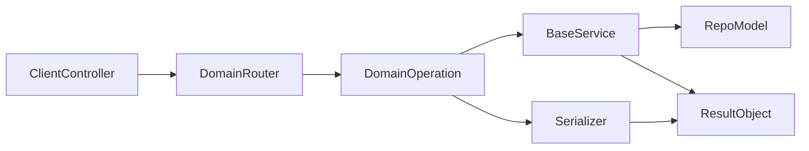

# Build Plan: Flexible Domain Service Gem (Versioned Roadmap)

## Product Goal

Create a Rails gem that makes service-oriented architecture the easiest path, with optional enforcement. v1 will prioritize developer adoption: strong defaults, generators, lint-style checks, and optional strict mode later.

## Proposed Gem Name Options

- `railsmith` (service-centric Rails conventions)
- `domain_service_rails` (explicit and searchable)
- `rails_service_hub` (all-in-one positioning)
- `service_layer_rails` (clear and practical)
- `domain_ops_rails` (Trailblazer-like operation framing)

## Recommended Gem Names (Good + Catchy)

- `railsmith` (recommended): short, strong, and architecture-oriented.
- `servora`: memorable and service-first identity.
- `opsforge`: operation-pipeline + composition vibe.
- `domroute`: clear domain-routing signal.
- `boundrail`: strong boundary-focused branding.
- `layerlane`: clean service-layer convention message.

## Selected Gem Name

- Final choice: `railsmith`
- RubyGems package: `railsmith`
- Ruby module namespace: `Railsmith`

## v1 Scope (Flexible + Full Domain Router Layer)

- Domain router abstraction layer to define domain-first routes and map to domain operations.
- Base service framework with default CRUD and bulk actions (`create`, `update`, `destroy`, `bulk_create`, `bulk_update`, `bulk_destroy`).
- Service registry + generators so each model gets a service class scaffold (can be empty and inherit defaults).
- Read path uses serializers for `show`/retrieval responses.
- Unified result contract inspired by dry-rb (`Success`/`Failure`, typed error payloads, codes, metadata).
- Non-blocking architecture checks (warnings in CI/dev) for direct model usage and cross-domain leaks.

## Version Plan (All Versions)

### v0.1.0 (Bootstrap)

- Gem skeleton, configuration loader, and install generator.
- `Result` API (`success`/`failure`) and normalized error objects.
- Base service shell with hooks and no-op defaults.

### v0.2.0 (CRUD Foundation)

- Default CRUD actions in `BaseService`: `create`, `update`, `destroy`, `show`, `index`.
- Serializer adapter contract and default serializer lookup.
- Model-service generator ensures every model can have at least an empty service class.

### v0.3.0 (Bulk Operations)

- Built-in `bulk_create`, `bulk_update`, `bulk_destroy` with per-item result aggregation.
- Partial success/failure contract (batch summary + item-level errors).
- Transaction strategy options (`all_or_nothing`, `best_effort`).

### v0.4.0 (Domain Router Layer)

- Domain-based routing DSL and operation mapping.
- Domain context propagation (`current_domain`, request metadata).
- Cross-domain call tracing with allowlist support.

### v0.5.0 (Architecture Warnings)

- Non-blocking checks for direct model usage from controllers.
- Warnings for missing model service classes.
- CI-friendly report formatter (text + JSON).

### v1.0.0 (Stable Flexible Release)

- Full flexible mode GA: defaults + generators + checks (no hard blocking).
- End-to-end docs, cookbook, and migration guide for existing apps.
- Stability guarantees for public DSL and result contract.

### v1.1.0 (Developer Experience)

- Better generators (`domain`, `operation`, `serializer`, `policy` templates).
- Error localization helpers and standardized API response helpers.
- Performance improvements for checks and route mapping.

### v1.2.0 (Strict Mode Preview)

- Optional strict mode flags:
  - require service usage for model mutations
  - block unapproved cross-domain calls
  - fail CI on boundary violations
- Incremental adoption controls per domain.

### v2.0.0 (Strict-by-Default Option)

- Strict mode promoted and hardened for large teams.
- More explicit operation pipeline (Trailblazer-like step contracts).
- Breaking changes only where needed for clearer boundaries and safer defaults.

### v3.0.0 (Enterprise Domain Platform)

- Advanced domain router plugins (versioned domains, tenancy-aware routing).
- Architecture drift analytics and trend reports.
- Policy packs and rule marketplace for organization-wide conventions.

## Core Architecture

## Gem Internals

- `Core`:
  - `BaseService`: lifecycle hooks (`before_validate`, `before_persist`, `after_commit`) and default CRUD/bulk implementations.
  - `Result`: `success?`, `failure?`, `value`, `error`, `code`, `meta`.
  - `Errors`: normalized error builder (`validation_error`, `conflict`, `not_found`, `unauthorized`, `unexpected`).
- `Domain`:
  - `DomainRouter`: DSL for domain route groups and operation mapping.
  - `DomainContext`: current domain metadata for checks/logging.
- `Serialization`:
  - Adapter layer for common serializer gems (ActiveModelSerializers/Blueprinter/jsonapi-serializer), with fallback plain serializer interface.
- `Generators`:
  - install generator (initializer, folder layout, sample domain)
  - model-service generator (empty subclass of BaseService + operation stubs)
  - domain generator (routes + operations + serializer skeleton)
- `Checks` (non-blocking in v1):
  - warn when controller references model directly.
  - warn when operation crosses domain boundary without explicit allowlist.

## Public DSL (v1 shape)

- `DomainRouter.draw` for domain-based route declarations.
- `BaseService.call(action:, params:, context:)` default entrypoint.
- Optional operation classes for step-based workflows (Trailblazer-inspired), but lightweight.
- `Result.success(value:, meta:)` and `Result.failure(code:, message:, details:)`.

## Rollout Phases

- Phase 1: skeleton gem, config, result objects, base CRUD.
- Phase 2: bulk actions + serializer integration + generators.
- Phase 3: domain router abstraction + operation mapping.
- Phase 4: architecture checks + CI formatter + docs examples.
- Phase 5: strict mode preview (off by default), migration guide.

## Release Mapping (Phase -> Version)

- Phase 1 -> `v0.1.0`
- Phase 2 -> `v0.2.0` and `v0.3.0`
- Phase 3 -> `v0.4.0`
- Phase 4 -> `v0.5.0`
- Phase 5 -> `v1.2.0`
- Stable flexible milestone -> `v1.0.0`

## Suggested Delivery Cadence (2-Week Sprints)

### Sprint 1 (Weeks 1-2) -> `v0.1.0`

- Ship gem skeleton, config loader, and install generator.
- Implement `Result.success` and `Result.failure` contracts.
- Publish minimal docs: install and first service call.

### Sprint 2 (Weeks 3-4) -> `v0.2.0`

- Implement BaseService CRUD defaults.
- Add serializer adapter interface and resolver.
- Add model service stub generator (including empty service support).

### Sprint 3 (Weeks 5-6) -> `v0.3.0`

- Implement bulk methods with item-level statuses.
- Add transaction strategies and error aggregation format.
- Document batch behavior and practical limits.

### Sprint 4 (Weeks 7-8) -> `v0.4.0`

- Build domain router DSL and operation mapping.
- Add domain context propagation and route-domain checks.
- Publish full domain CRUD walkthrough docs.

### Sprint 5 (Weeks 9-10) -> `v0.5.0`

- Ship non-blocking architecture checks and CI formatter.
- Add migration path for legacy controllers/models.
- Publish adoption playbook for progressive rollout.

### Sprint 6 (Weeks 11-12) -> `v1.0.0`

- Stabilize public APIs and lock docs.
- Improve generator developer experience.
- Release production-ready flexible mode.

### Sprint 7 (Weeks 13-14) -> `v1.1.0`

- Add advanced generator templates.
- Improve diagnostics and check performance.
- Add integration templates for common API stacks.

### Sprint 8 (Weeks 15-16) -> `v1.2.0`

- Deliver strict mode preview with per-domain toggles.
- Add CI fail-on-violation option and policy presets.
- Publish strict adoption guide and upgrade notes.

## Documentation Strategy

- Quick start in 5 minutes (install + generate + first domain route + first operation).
- Cookbook:
  - simple CRUD service
  - bulk import with partial failure handling
  - domain route setup
  - serializer setup for show/index
  - custom error mapping
- Adoption guide for legacy apps:
  - start in warning mode
  - scaffold services gradually per model
  - flip selected domains to strict mode later.

## Definition of Done for v1

- A new Rails app can install gem and ship one domain feature entirely via services in <30 minutes.
- All model-facing controller actions are replaceable by generated services.
- Bulk methods and serializer retrieval work out-of-box.
- Result/error contracts are consistent and test-friendly.
- Docs include end-to-end sample app flow.

