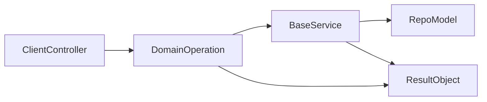

# Build Plan: Flexible Domain Service Gem (Versioned Roadmap)

## Product Goal

Create a Rails gem that makes service-oriented architecture the easiest path, with optional enforcement. v1 will prioritize developer adoption: strong defaults, generators, lint-style checks, and optional strict mode later.

Railsmith should feel like a pragmatic replacement for Trailblazer-style domain “concepts/operations” in apps that want the benefits (clear business-logic boundaries, composable workflows) without adopting a large framework surface area. Keep configuration and maintenance low: plain Ruby classes, explicit context, and Rails-friendly conventions.

## Proposed Gem Name Options

- `railsmith` (service-centric Rails conventions)
- `domain_service_rails` (explicit and searchable)
- `rails_service_hub` (all-in-one positioning)
- `service_layer_rails` (clear and practical)
- `domain_ops_rails` (Trailblazer-like operation framing)

## Recommended Gem Names (Good + Catchy)

- `railsmith` (recommended): short, strong, and architecture-oriented.
- `servora`: memorable and service-first identity.
- `opsforge`: operation-pipeline + composition vibe.
- `domroute`: clear domain boundary signal.
- `boundrail`: strong boundary-focused branding.
- `layerlane`: clean service-layer convention message.

## Selected Gem Name

- Final choice: `railsmith`
- RubyGems package: `railsmith`
- Ruby module namespace: `Railsmith`

## v1 Scope (Flexible + Domain Boundaries)

- Domain-oriented conventions and context propagation to support bounded contexts without requiring a central resolver.
- Base service framework with default CRUD and bulk actions (`create`, `update`, `destroy`, `bulk_create`, `bulk_update`, `bulk_destroy`).
- Service registry + generators so each model gets a service class scaffold (can be empty and inherit defaults).
- Unified result contract inspired by dry-rb (`Success`/`Failure`, typed error payloads, codes, metadata).
- Non-blocking architecture checks (warnings in CI/dev) for direct model usage and cross-domain leaks.

## App-Level Domain Context (Host App Integration Plan)

We need to support “domain level” behavior in the *actual Rails application*: a request arrives at `host` (and/or `subdomain`, `path`, headers), the app determines the **current domain**, and that domain context is propagated into service/operation execution consistently.

### Goals

- Requests map deterministically to a **domain key** (example: `:billing`, `:identity`, `:catalog`).
- The **domain key is propagated** into service/operation execution as `context[:current_domain]` (plus request metadata).
- The host app can choose its strategy (host-based, subdomain-based, path-based, header-based) without rewriting operations.
- Works with normal Rails routing; Railsmith does not replace Rails routing.

### Recommended Integration Shape (Default)

- **Domain identification** happens early per request (controller concern or middleware).
- Domain-specific controller/actions (or a thin “endpoint operation” layer) call the appropriate domain operation/service directly, so controllers remain simple without requiring an extra resolver.

Concrete pieces:

- **`Railsmith::Domain::Detector` (host app responsibility in v1)**:
  - A small callable configured by the app, returning a domain key and metadata.
  - Inputs: `request` (host, subdomain, path, headers), `current_user` (optional).
  - Output example:
    - `domain: :billing`
    - `meta: { host: request.host, request_id: request.request_id }`

- **`Railsmith::DomainContext` (gem responsibility)**:
  - A simple, explicit data container for `current_domain` + request metadata.
  - Passed into services/operations as `context`.
  - Must not rely on globals by default; allow optional integration with `ActiveSupport::CurrentAttributes` later.

### Host App Wiring Options (Supported Patterns)

We should explicitly support these common approaches; the gem should provide helpers but remain flexible:

- **Host/subdomain-based** (most common):
  - `billing.example.com` → `:billing`
  - `api.example.com` + `/billing/...` → `:billing` (hybrid)
- **Path-based**:
  - `/billing/...` → `:billing`
- **Header-based** (multi-tenant gateways / internal APIs):
  - `X-Domain: billing` → `:billing`
- **Tenant + domain (two-dimensional)**:
  - Domain is still a **bounded-context key**; tenancy is separate metadata:
  - `context[:tenant_id]`, `context[:account_id]`, etc.

### Rails Touchpoints (Where This Lives in the App)

- **`ApplicationController` concern** (recommended first):
  - `before_action :set_domain_context`
  - Build `context = Railsmith::DomainContext.new(current_domain:, meta: ...)`
  - Store in an instance variable: `@railsmith_context`
  - Pass to calls explicitly: `SomeOperation.call(params:, context: @railsmith_context.to_h)`

- **Middleware** (optional):
  - For apps that need domain context outside controllers (jobs triggered by request, logging tags).
  - v1 can keep this as “bring your own”; document how to do it.

- **Rails routes constraints** (optional, *only* for request dispatching):
  - Use Rails constraints to route traffic to different controllers or namespaces.
  - Railsmith should not require constraints, but docs should show examples because this is what people mean by “domain-level routing”.

### Proposed DSL Additions (to Make This Easy)

Avoid a required router/resolver DSL in v1. Instead:

- Provide a small `DomainContext` object and helper(s) to build it from request metadata.
- Provide conventions + generators so teams can organize code by bounded context:
  - `app/domains/billing/...`
  - `Billing::Invoices::Create`
  - `Billing::InvoiceService`

### Minimal Example (Doc-Level Target)

- Request comes in on `billing.example.com`.
- App `Domain::Detector` returns `:billing`.
- Controller calls the domain operation/service directly:
  - `Billing::Invoices::Create.call(params:, context: @railsmith_context.to_h)`
- The operation/service receives:
  - `params` (request params)
  - `context` (`current_domain`, `request_id`, `actor`, `tenant_id`)

### Testing Plan (So This Doesn’t Drift)

- **Unit tests** (gem):
  - `DomainContext` behaviors and serialization
  - Context is passed through unchanged (services/operations do not mutate caller data)
- **Integration tests** (dummy Rails app in spec):
  - A controller endpoint sets `current_domain` using a host/subdomain detector and calls a domain operation/service directly.
  - Ensure a request to `billing.example.com` builds `current_domain: :billing` and the called operation sees it in `context`.

## Version Plan (All Versions)

### v0.1.0 (Bootstrap)

- Gem skeleton, configuration loader, and install generator.
- `Result` API (`success`/`failure`) and normalized error objects.
- Base service shell with hooks and no-op defaults.

### v0.2.0 (CRUD Foundation)

- Default CRUD actions in `BaseService`: `create`, `update`, `destroy`.
- Model-service generator ensures every model can have at least an empty service class.

### v0.3.0 (Bulk Operations)

- Built-in `bulk_create`, `bulk_update`, `bulk_destroy` with per-item result aggregation.
- Partial success/failure contract (batch summary + item-level errors).
- Transaction strategy options (`all_or_nothing`, `best_effort`).

### v0.4.0 (Domain Context + Conventions)

- Domain context propagation (`current_domain`, request metadata).
- Domain-oriented folder/module conventions + generators.
- Cross-domain call tracing/guardrails based on propagated context (warn-only).

### v0.5.0 (Architecture Warnings)

- Non-blocking checks for direct model usage from controllers.
- Warnings for missing model service classes.
- CI-friendly report formatter (text + JSON).

### v1.0.0 (Stable Flexible Release)

- Full flexible mode GA: defaults + generators + checks (no hard blocking).
- End-to-end docs, cookbook, and migration guide for existing apps.
- Stability guarantees for public DSL and result contract.

### v1.1.0 (Developer Experience)

- Better generators (`domain`, `operation`, `policy` templates).
- Error localization helpers and standardized API response helpers.
- Performance improvements for checks and route mapping.

### v1.2.0 (Strict Mode Preview)

- Optional strict mode flags:
  - require service usage for model mutations
  - block unapproved cross-domain calls
  - fail CI on boundary violations
- Incremental adoption controls per domain.

### v2.0.0 (Strict-by-Default Option)

- Strict mode promoted and hardened for large teams.
- More explicit operation pipeline (Trailblazer-like step contracts).
- Breaking changes only where needed for clearer boundaries and safer defaults.

### v3.0.0 (Enterprise Domain Platform)

- Advanced domain boundary plugins (domain versioning, tenancy-aware context helpers).
- Architecture drift analytics and trend reports.
- Policy packs and rule marketplace for organization-wide conventions.

## Core Architecture

## Gem Internals

- `Core`:
  - `BaseService`: lifecycle hooks (`before_validate`, `before_persist`, `after_commit`) and default CRUD/bulk implementations.
  - `Result`: `success?`, `failure?`, `value`, `error`, `code`, `meta`.
  - `Errors`: normalized error builder (`validation_error`, `conflict`, `not_found`, `unauthorized`, `unexpected`).
- `Domain`:
  - `DomainContext`: current domain metadata for checks/logging.
- `Generators`:
  - install generator (initializer, folder layout, sample domain)
  - model-service generator (empty subclass of BaseService + operation stubs)
  - domain generator (module + operation/service skeleton)
- `Checks` (non-blocking in v1):
  - warn when controller references model directly.
  - warn when operation crosses domain boundary without explicit allowlist.

## Public DSL (v1 shape)

- `BaseService.call(action:, params:, context:)` default entrypoint.
- Optional operation classes for step-based workflows (Trailblazer-inspired), but lightweight.
- `Result.success(value:, meta:)` and `Result.failure(code:, message:, details:)`.

## Rollout Phases

- Phase 1: skeleton gem, config, result objects, base CRUD.
- Phase 2: bulk actions + generators.
- Phase 3: domain context propagation + domain conventions (no resolver required).
- Phase 4: architecture checks + CI formatter + docs examples.
- Phase 5: strict mode preview (off by default), migration guide.

## Release Mapping (Phase -> Version)

- Phase 1 -> `v0.1.0`
- Phase 2 -> `v0.2.0` and `v0.3.0`
- Phase 3 -> `v0.4.0`
- Phase 4 -> `v0.5.0`
- Phase 5 -> `v1.2.0`
- Stable flexible milestone -> `v1.0.0`

## Suggested Delivery Cadence (2-Week Sprints)

### Sprint 1 (Weeks 1-2) -> `v0.1.0`

- Ship gem skeleton, config loader, and install generator.
- Implement `Result.success` and `Result.failure` contracts.
- Publish minimal docs: install and first service call.

### Sprint 2 (Weeks 3-4) -> `v0.2.0`

- Implement BaseService CRUD defaults.
- Add model service stub generator (including empty service support).

### Sprint 3 (Weeks 5-6) -> `v0.3.0`

- Implement bulk methods with item-level statuses.
- Add transaction strategies and error aggregation format.
- Document batch behavior and practical limits.

### Sprint 4 (Weeks 7-8) -> `v0.4.0`

- Add domain context propagation (`current_domain`, request metadata).
- Add domain conventions + generators (domain module skeletons, operation/service scaffolds).
- Publish full domain CRUD walkthrough docs (without a resolver dependency).

### Sprint 5 (Weeks 9-10) -> `v0.5.0`

- Ship non-blocking architecture checks and CI formatter.
- Add migration path for legacy controllers/models.
- Publish adoption playbook for progressive rollout.

### Sprint 6 (Weeks 11-12) -> `v1.0.0`

- Stabilize public APIs and lock docs.
- Improve generator developer experience.
- Release production-ready flexible mode.

### Sprint 7 (Weeks 13-14) -> `v1.1.0`

- Add advanced generator templates.
- Improve diagnostics and check performance.
- Add integration templates for common API stacks.

### Sprint 8 (Weeks 15-16) -> `v1.2.0`

- Deliver strict mode preview with per-domain toggles.
- Add CI fail-on-violation option and policy presets.
- Publish strict adoption guide and upgrade notes.

## Documentation Strategy

- Quick start in 5 minutes (install + generate + first domain context + first operation).
- Cookbook:
  - simple CRUD service
  - bulk import with partial failure handling
  - domain context setup
  - custom error mapping
- Adoption guide for legacy apps:
  - start in warning mode
  - scaffold services gradually per model
  - flip selected domains to strict mode later.

## Definition of Done for v1

- A new Rails app can install gem and ship one domain feature entirely via services in <30 minutes.
- All model-facing controller actions are replaceable by generated services.
- Bulk methods work out-of-box.
- Result/error contracts are consistent and test-friendly.
- Docs include end-to-end sample app flow.

